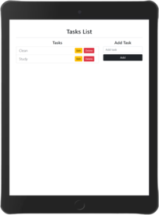
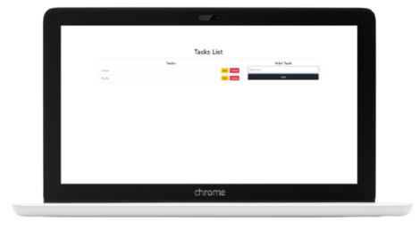

  

# **Tasks List**

## **About**

This is a responsive tasks list app developed with [](https://html.spec.whatwg.org/) [](https://www.w3.org/Style/CSS/) [](https://getbootstrap.com/) [](https://www.ecma-international.org/ecma-262/) and [](https://es.reactjs.org/)

Project inspired by the "Crud Hooks" exercise of the [**React JS Desde Cero! Hooks, Redux, Context, Firebase y más!**](https://www.udemy.com/course/curso-react-js/) course.

**[Project URL]()** is available on GitHub Pages.

## **Quick start guide**

Instructions to start this project:

## Installation

- Clone repository:

```
git clone [repository]
```

- Install NPM packages and dependencies:

```
npm install
```

- Run project on local server:

```
npm start
```

## **Features**

- React app
- Tasks list with a button to delete tasks and other button to edit tasks
- Form to add tasks to the list that turns into a form to edit tasks

## **Usage**

### **1. App component**

- Handle app and events and render tasks list and app components

```javascript
function App() {
  const [task, setTask] = useState("");
  const [tasksList, setTasksList] = useState([]);
  const [edit, setEdit] = useState(false);
  const [id, setId] = useState("");
  const [error, setError] = useState(null);

  const handleChange = (e) => {
    const inputValue = e.target.value;
    setTask(inputValue);
  };

  const handleSubmit = (e) => {
    e.preventDefault();

    if (!task.trim()) {
      setError("Please, don't forget to add a task");
      return;
    }

    setTasksList([...tasksList, { id: shortid.generate(), task: task }]);
    setTask("");
    setError(null);
  };

  const handleClick = (id) => {
    const filterTasks = tasksList.filter((item) => item.id !== id);
    setTasksList(filterTasks);
    setError(null);
  };

  const handleEdit = (item) => {
    setEdit(true);
    setTask(item.task);
    setId(item.id);
    setError(null);
  };

  const editTask = (e) => {
    e.preventDefault();

    if (!task.trim()) {
      setError("Please, don't forget to add a task");
      return;
    }

    const editedArray = tasksList.map((item) =>
      item.id === id ? { id: id, task: task } : item
    );
    setTasksList(editedArray);
    setEdit(false);
    setTask("");
    setId("");
    setError(null);
  };

  const tasks = tasksList.map((item) => (
    <li className="list-group-item" key={item.id}>
      <span className="lead">{item.task}</span>
      <button
        className="btn btn-danger btn-sm float-end mx-2"
        onClick={() => handleClick(item.id)}
      >
        Delete
      </button>
      <button
        className="btn btn-warning btn-sm float-end"
        onClick={() => handleEdit(item)}
      >
        Edit
      </button>
    </li>
  ));

  return (
    <div className="container mt-5">
      <h1 className="text-center">Tasks List</h1>
      <hr />
      <div className="row">
        <TasksList tasks={tasks} />
        <Form
          task={task}
          edit={edit}
          error={error}
          handleChange={handleChange}
          handleSubmit={handleSubmit}
          handleClick={handleClick}
          handleEdit={handleEdit}
          editTask={editTask}
        />
      </div>
    </div>
  );
}
```

### **2. TasksList component**

- Render TasksList component

```javascript
const TasksList = (props) => {
  const list =
    props.tasks.length === 0 ? (
      <li className="list-group-item">There are no tasks</li>
    ) : (
      props.tasks
    );

  return (
    <div className="col-8">
      <h4 className="text-center">Tasks</h4>
      <ul className="list-group">{list}</ul>
    </div>
  );
};
```

### **3. Form component**

- Render Form component

```javascript
const Form = (props) => {
  const error = props.error ? (
    <span className="text-danger">{props.error}</span>
  ) : null;

  const button = props.edit ? (
    <button className="btn btn-warning btn-block col-12" type="submit">
      Edit
    </button>
  ) : (
    <button className="btn btn-dark btn-block col-12" type="submit">
      Add
    </button>
  );

  return (
    <div className="col-4">
      <h4 className="text-center">{props.edit ? "Edit Task" : "Add Task"}</h4>
      <form onSubmit={props.edit ? props.editTask : props.handleSubmit}>
        <input
          type="text"
          placeholder="Add task"
          value={props.task}
          className="form-control mb-2"
          onChange={props.handleChange}
        />
        {error}
        {button}
      </form>
    </div>
  );
};
```

## **Folder Structure**

```
Tasks List
├── docs
├── node_modules
├── public
├── src
│   ├── components
│   │   ├── Form.jsx
│   │   └── TasksList.jsx
│   ├── images
│   │    ├── tasks_list_desktop.png
│   │    ├── tasks_list_mobile.png
│   │    └── tasks_list_tablet.png
│   ├── App.jsx
│   ├── index.css
│   └── index.jsx
├── .gitignore
├── LICENSE
├── package-lock.json
├── package.json
└── README.md
```

## **License**

This project is licensed under 
